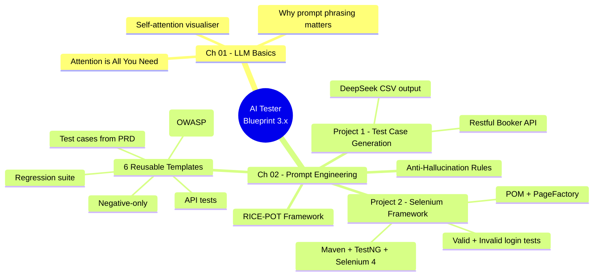
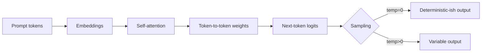

# AI Tester Blueprint 3.x

A practical, project-driven curriculum for QA engineers learning to use LLMs as a real testing tool — not a toy.
Each chapter pairs concept material with a hands-on project, a prompt template, and runnable code where applicable.


---

## Curriculum Map



---

## Repository Layout

```
.
├── chapter_01_LLM_Basics/         How transformers and attention work
│   ├── attention_interactive.html
│   ├── attention_is_all_you_need.html
│   └── Notes.md
│
└── chapter_02_Prompt_Eng/         Prompt engineering for QA work
    ├── Anti_Hallucinations_Rules.md
    ├── Project1_TC_Gen/           Test case generation from a PRD/API doc
    │   ├── RICE-POT-TestCase-Prompt.md
    │   ├── RICE_POT_FRAMEWORK/
    │   ├── Restful-booker.pdf
    │   ├── Restful_Booker_API_Test_Cases.md
    │   └── output/
    ├── Project2_Selenium_Framework/   POM-based Selenium framework built from a prompt
    │   ├── Problem.md
    │   ├── SKILL.md                   RICE-POT prompt-builder skill
    │   ├── blank-template-rice-pot.md
    │   └── AdvanceSeleniumFramework/  Maven + TestNG + Selenium 4
    └── templates/                 Reusable prompt templates (RTCFR / RICE-POT)
        ├── 01_TestCaseGeneration_Prompt.md
        ├── 02_TestCases_from_prd
        ├── 03_API_Test_Generation.md
        ├── 04_Negative_TC_Only.md
        ├── 05_Secuirty_Test.md
        └── 06_Regression_Suite.md
```

---

## Chapter 01 — LLM Basics

Foundational material on how Large Language Models read text and decide what to output. The key idea: a model is not a database lookup — it weighs every token against every other token (attention) and predicts the next one.

**What's here:**
- `attention_is_all_you_need.html` — interactive walkthrough of the original Transformer paper concepts.
- `attention_interactive.html` — visualises self-attention so you can see why prompt phrasing changes outputs.
- `Notes.md` — short recap notes.

**Why a QA engineer should care:** the model's behaviour is deterministic-ish on a per-token level, but every word you add to a prompt shifts the attention weights. That is why structured prompt frameworks (next chapter) outperform free-form questions.

**Q&A — why this matters for testing:**
- **Q: Why does the same prompt give different test cases each run?** A: Sampling temperature plus floating-point non-determinism in attention. Pin `temperature=0` and set explicit constraints to flatten variance.
- **Q: Why does adding "be thorough" rarely help?** A: Vague tokens add weight without direction. Replace with measurable constraints — "cover boundary, negative, and security cases" steers attention to specific output shape.
- **Q: Do I need to read the original Transformer paper?** A: No — but understanding that the model weighs every token against every other token explains why irrelevant words in your prompt pollute the answer.

**Mental model — how one prompt token influences the output:**



**Quick demo — try it locally:**

```bash
# clone, then just open the HTML files in a browser - no build, no install
open chapter_01_LLM_Basics/attention_interactive.html
open chapter_01_LLM_Basics/attention_is_all_you_need.html
```

Hover over tokens in `attention_interactive.html` to see the live attention matrix. Edit the input sentence to see weights shift in real time — that's the same mechanism that makes your prompt wording matter.

---
